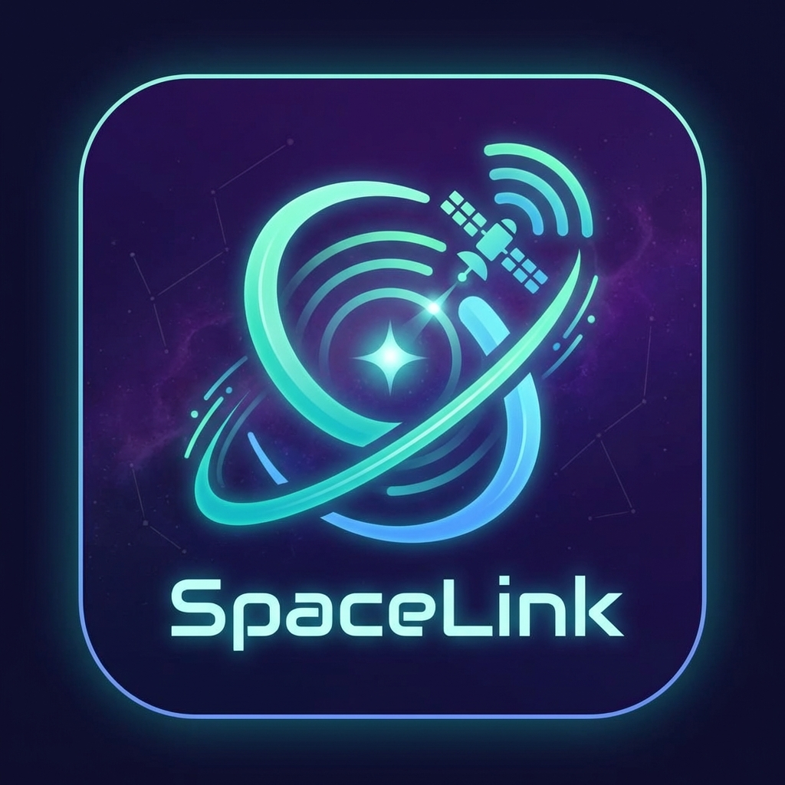

# 🛰️ SpaceLink

<p align="center">
  
</p>

<p align="center">
  <strong>Ultra-Low Latency Remote Desktop Solution</strong>
</p>

<p align="center">
  
  
  
  
</p>

---

## ✨ Features

SpaceLink is a feature-rich remote desktop solution inspired by **Parsec**, **AnyDesk**, and **TeamViewer**.

| Category | Features |
|----------|----------|
| 🎮 **Streaming** | WebRTC video, audio, gamepad, touch gestures |
| ⚡ **Performance** | Adaptive bitrate (360p-4K), H.265/AV1, hardware encoding |
| 🔒 **Security** | AES-256 encryption, 2FA, audit logging |
| 🤝 **Collaboration** | Multi-user, whiteboard, chat, VoIP |
| 🛠️ **System** | Power control, window manager, remote printing |

---

## 📁 Project Structure

```
SpaceLink/
├── run.py                 # 🚀 Entry point
├── requirements.txt       # Dependencies
│
├── src/
│   ├── core/              # Core server components
│   │   ├── server.py      # FastAPI main server
│   │   ├── webrtc_server.py
│   │   ├── input_control.py
│   │   └── ai_agent.py
│   │
│   ├── modules/           # Feature modules
│   │   ├── file_transfer.py
│   │   ├── clipboard_sync.py
│   │   ├── recorder.py
│   │   └── ...
│   │
│   ├── security/          # Security & auth
│   │   ├── auth.py
│   │   ├── security.py    # AES-256 + 2FA
│   │   └── audit_log.py
│   │
│   ├── collaboration/     # Multi-user features
│   │   ├── collaboration.py
│   │   ├── whiteboard.py
│   │   └── voip.py
│   │
│   └── utils/             # Utilities
│       ├── power_control.py
│       ├── system_stats.py
│       └── ...
│
├── clients/               # Client applications
│   ├── webrtc_client.html # Web client
│   └── SpaceLinkClient.swift
│
└── docs/                  # Documentation
    └── architecture.png
```

---

## 🚀 Quick Start

```bash
# Clone repository
git clone https://github.com/cheehow95/SpaceLink.git
cd SpaceLink

# Install dependencies
pip install -r requirements.txt

# Start server
python run.py
```

Open browser: `http://localhost:8000/webrtc-test`

---

## 📖 Documentation

| Document | Description |
|----------|-------------|
| [INSTALLATION.md](INSTALLATION.md) | Setup guide for all platforms |
| [FEATURES.md](FEATURES.md) | Detailed feature documentation |

---

## 📊 API (120+ Endpoints)

| Category | Endpoints |
|----------|-----------|
| WebRTC | `/offer`, `/answer`, `/ice` |
| Files | `/files/*` |
| Power | `/power/*` |
| Stats | `/stats/*` |
| Optimization | `/optimize/*` |
| Collaboration | `/collab/*`, `/whiteboard/*` |
| VoIP | `/voip/*` |

Full API docs at: `http://localhost:8000/docs`

---

## 📄 License

MIT License - see [LICENSE](LICENSE)

---

<p align="center">
  Made with ❤️ | Inspired by Parsec, AnyDesk, TeamViewer
</p>
